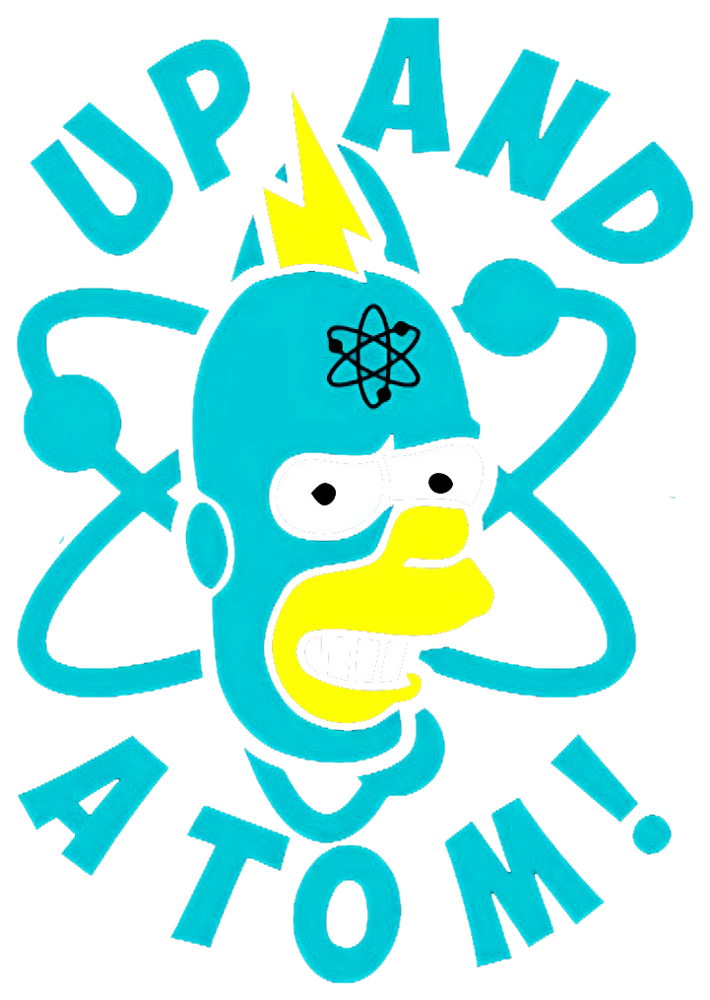

# 👨🏼‍🚀 Hi stranger, I'm Victor

**`Digital Solutions Creator (Developer/Designer)`**

 

Welcome to my profile, I'm currently a Front-End developer and I aim to be one of the best React  developers in the world. I've worked with many kinds of projects, from simple landing page projects tocomplex applications like a crypto trading platform and a entire desing system library. Currently myfocus is being an expert in React, Nextjs and Typescript but I have knowledge in React Native too. Youcan see all my projects in my "portfolio" or see below a summary of each one. Oh, I have great conversational English!

  
  

#

 

### ⛏️ Languages and tools
   
  
  
  
  
  
  
  
  
  
  
  

